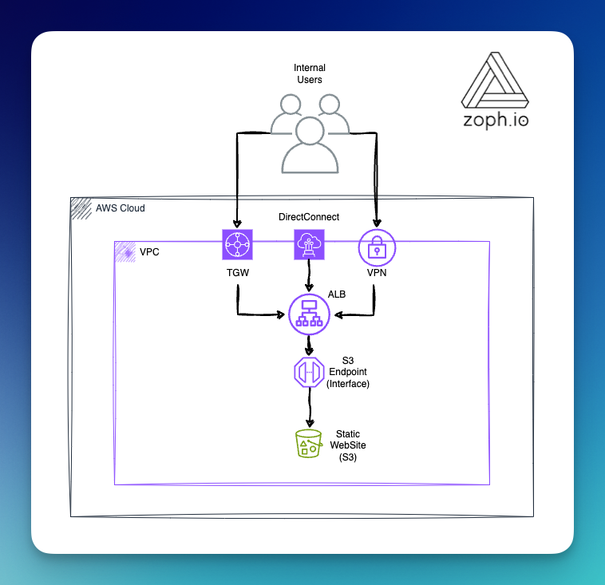

# 🏰 AWS Internal Static Web Hosting

## :brain: Rationale

When considering hosting a static website on AWS, the go-to solution often involves combining CloudFront with S3. However, if your project entails stringent privacy requirements and is intended solely for internal users, configuring CloudFront with these constraints can be both complex and challenging.

This blueprint provides a detailed example of hosting a static website internally on AWS, utilizing an **Internal** Application Load Balancer (ALB), an S3 VPC Endpoint Interface, and a Private S3 Bucket. This setup ensures enhanced privacy and internal access control.

You are encouraged to tailor this blueprint to fit your specific requirements.

Additionally, contributions through pull requests for further improvements are always welcome.

## 📋 Requirements

1. Route53 Hosted Domain
2. ACM Certificate
3. VPC with Private Subnets

## 📐 Architecture

## :keyboard: Usage

First, you will need to adapt the parameters in the `Makefile`.

Then, run the following command:

    $ make deploy

## 🖌️ Static Website

You will have to deploy your static website into the created S3 bucket that is named with your `DomainName` variable. Done ✅.

## ✋ CleanUp

    $ make tear-down

## :man_technologist: Credits

- 🏴‍☠️ AWS Security Boutique: [zoph.io](https://zoph.io?utm_source=aiswh)
- 💌 [AWS Security Digest Newsletter](https://awssecuritydigest.com?utm_source=aiswh)
- 🐦 𝕏/Twitter: [zoph](https://twitter.com/zoph)

## 🤔 Inspiration

- [Hosting Internal HTTPS Static Websites with ALB, S3, and PrivateLink](https://aws.amazon.com/blogs/networking-and-content-delivery/hosting-internal-https-static-websites-with-alb-s3-and-privatelink/) from Schuyler Jager
- [Dealing with missing !Ref in CloudFormation](https://dev.classmethod.jp/articles/transfer-for-sftp-restrict-ip-cloudformation/)
